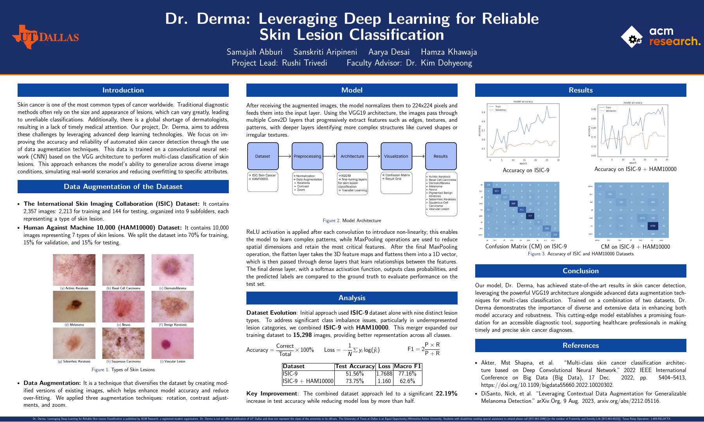

# Dr. Derma

### Transfer learning for multi-class skin lesion classification

[](https://www.python.org/)
[](https://www.tensorflow.org/)
[](#model)
[](#responsible-use)

Dr. Derma is a computer-vision research project that explores whether transfer learning and image augmentation can improve skin lesion classification. The project combines a pretrained VGG19 backbone with a custom classification head and a two-stage training strategy: feature extraction followed by selective fine-tuning.

> **Research prototype:** Dr. Derma is not a medical device and must not be used to diagnose, treat, or rule out disease.

## At a glance

| Area | Implementation |
| --- | --- |
| Problem | Multi-class skin lesion image classification |
| Data | ISIC-9 and HAM10000 experiments |
| Backbone | VGG19 pretrained on ImageNet |
| Generalization | Rotation, contrast, zoom, and horizontal-flip augmentation |
| Training | Frozen-backbone feature extraction, then block-5 fine-tuning |
| Best poster result | **73.75% test accuracy** on the combined dataset |

## Results

The research poster reports the following held-out test results:

| Experiment | Test accuracy | Loss | Macro F1 |
| --- | ---: | ---: | ---: |
| ISIC-9 | 51.56% | 1.7688 | 77.16% |
| ISIC-9 + HAM10000 | **73.75%** | **1.1600** | 62.60% |

Combining the datasets improved test accuracy by **22.19 percentage points** and reduced loss by approximately **34%**. Macro F1 decreased, however, suggesting that per-class performance and class imbalance still need closer investigation. That tradeoff is important: accuracy alone does not establish clinical reliability.

The included notebook also records an earlier **binary-classification** experiment on 2,109 images. Fine-tuning increased its test accuracy from **79.17% to 80.21%**. These numbers are kept separate because they come from a different task and dataset configuration.



[View the full research poster](docs/dr-derma-research-poster.pdf)

## Model

```text
224 x 224 RGB image
        |
On-the-fly augmentation
        |
VGG19 convolutional backbone (ImageNet weights)
        |
Global average pooling
        |
Dense (256, ReLU) + Dropout
        |
Softmax class probabilities
```

The production-friendly training script uses global average pooling instead of flattening the full feature map, which substantially reduces the number of trainable parameters in the classification head. It also preserves source images by applying augmentation in the TensorFlow input pipeline rather than rewriting files on disk.

## Repository structure

```text
.
├── docs/
│   ├── dr-derma-research-poster.pdf
│   └── images/research-poster-preview.png
├── notebooks/
│   └── vgg19-training-augmentation.ipynb
├── src/
│   └── train.py
├── .gitignore
├── requirements.txt
└── README.md
```

## Quick start

### 1. Create an environment

```bash
python3 -m venv .venv
source .venv/bin/activate
python -m pip install --upgrade pip
pip install -r requirements.txt
```

### 2. Arrange the data

The dataset is not committed to this repository. Prepare class-labeled folders in this shape:

```text
data/
├── train/
│   ├── class_a/
│   └── class_b/
├── validation/
│   ├── class_a/
│   └── class_b/
└── test/
    ├── class_a/
    └── class_b/
```

Every split must contain the same class-folder names. Images can use formats supported by `tf.keras.utils.image_dataset_from_directory`.

### 3. Train and evaluate

```bash
python src/train.py \
  --data-dir data \
  --epochs 20 \
  --fine-tune-epochs 10 \
  --output-dir artifacts
```

The command saves the best Keras model, training history, class names, run configuration, and final test metrics under `artifacts/`. Run `python src/train.py --help` for all options.

## Engineering decisions

- **Reproducibility:** a single seed is applied to dataset loading and TensorFlow operations.
- **No destructive preprocessing:** augmentation runs in memory and never deletes or overwrites source images.
- **Leakage-resistant evaluation:** training, validation, and test directories remain separate; augmentation runs only while training.
- **Stable optimization:** early stopping, learning-rate reduction, and best-checkpoint restoration are enabled.
- **Portable outputs:** configuration, label order, training history, and test metrics are written as JSON.

## Next steps

- Report per-class precision, recall, F1, and confusion matrices for each experiment.
- Evaluate patient-level splits to reduce the risk of image-level data leakage.
- Compare VGG19 with lighter backbones such as EfficientNet or MobileNet.
- Add calibration and uncertainty analysis before considering any decision-support workflow.
- Document dataset licenses and exact preprocessing/version details for a fully reproducible study.

## Responsible use

Skin lesion classification is a high-stakes medical application. The results in this repository are retrospective research metrics, not evidence of clinical safety or efficacy. Real-world use would require representative external validation, demographic subgroup analysis, calibration, privacy review, regulatory assessment, and qualified clinician oversight.

## Team

- **Researchers:** Samajah Abburi, Sanskriti Aripineni, Aarya Desai, and Hamza Khawaja
- **Project lead:** Rushi Trivedi
- **Faculty advisor:** Dr. Kim Dohyeong

Developed through ACM Research at The University of Texas at Dallas.
